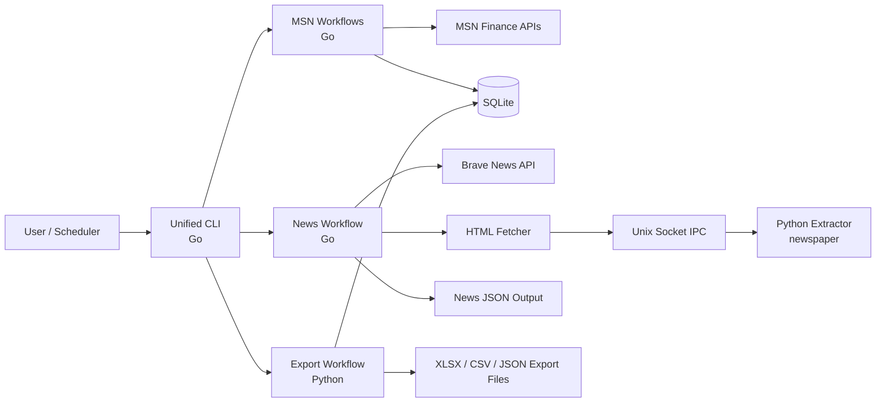
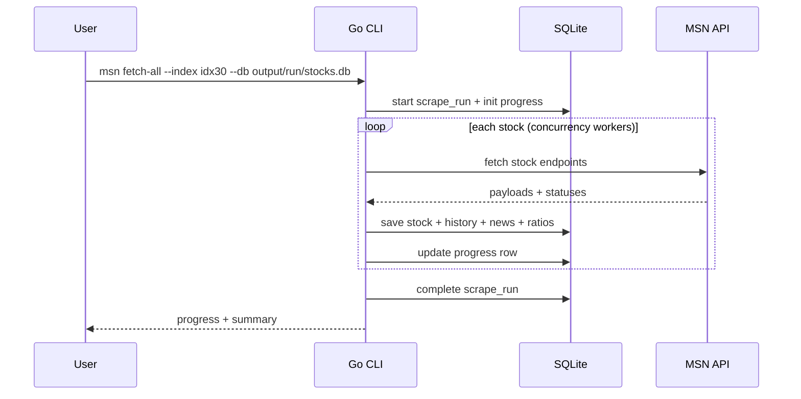
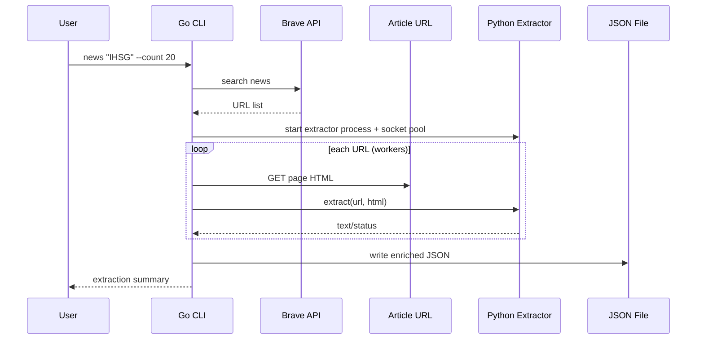

# Rubick

Enterprise-ready, multi-language CLI platform for Indonesian market intelligence.

This repository combines:
- high-throughput data collection from MSN Finance (Go),
- news discovery from Brave Search (Go),
- article-body extraction using `newspaper` (Python),
- structured export to JSON/CSV/XLSX (Python),
- SQLite persistence for repeatable historical analysis.

The system is built as one unified CLI with clear subcommands and strongly typed runtime boundaries so you can extend it safely without scattering code.

## Why This Project Exists

The goal is to solve a practical workflow problem:
- collect Indonesian stock fundamentals and snapshots,
- enrich stock context with real article text instead of headline-only snippets,
- persist data in a durable local store,
- export clean artifacts for analysis, reporting, and downstream automation.

Common use cases:
- analyst daily market snapshots,
- watchlist intelligence pipelines,
- historical trend extraction and spreadsheet exports,
- scheduled ETL feeding BI/ML workloads.

## Core Capabilities

- Unified CLI (`rubick`) with domain commands: `msn`, `news`, `export`, `extractor`.
- Live stock metadata and multi-endpoint stock fetch pipelines.
- Controlled concurrency and rate limiting for network-bound tasks.
- Python extractor process connected over Unix socket for fast IPC and language isolation.
- SQLite-based persistence for resumable scraping runs.
- Multiple export formats for both machine and human consumption.
- Regression tests and live API e2e test coverage.

## High-Level Architecture



## Runtime Data Flow

### 1. MSN bulk ingestion (`msn fetch-all`)



### 2. News enrichment (`news`)



## Repository Structure and Folder Contracts

```text
.
├── cmd/
│   └── rubick/      # canonical binary entrypoint
├── internal/
│   └── cli/                     # root command router + command implementations
├── msn/                         # MSN domain library: client, db, types, limiter, stock universe
├── scripts/                     # Python export scripts
├── tests/
│   ├── go/                      # Go CLI regression + live network e2e tests
│   └── test_export_simple.py    # Python exporter tests
├── extractor.py                 # Python unix-socket extraction service
├── main.go                      # compatibility entrypoint for local dev only
├── pyproject.toml               # Python deps and tooling
├── go.mod / go.sum              # Go module deps
└── README.md
```

Folder responsibilities:

| Path | Responsibility | Extension Rule |
|---|---|---|
| `cmd/rubick` | binary entrypoint only | keep thin; no business logic |
| `internal/cli` | command parsing, orchestration, runtime coordination | add new command handlers here |
| `msn` | data-source domain package and persistence internals | keep API/service-specific logic here |
| `scripts` | Python export implementations | each exporter should be independent CLI |
| `tests/go` | end-to-end and CLI behavior tests | test via public CLI behavior, not internals |
| `tests` | Python unit tests | one test module per script/component |

## Language Boundary (Go + Python)

Go is used for:
- CLI UX,
- concurrency and throughput,
- networking and orchestration,
- SQLite ingestion flows.

Python is used for:
- article extraction where ecosystem libraries are stronger,
- export formatting (especially XLSX convenience).

IPC contract:
- transport: Unix domain socket,
- framing: 4-byte big-endian length + JSON payload,
- request shape: `{ "url": string, "html": string }`,
- response shape: `{ "text": string, "status": "ok|failed", "error"?: string }`.

Reliability safeguards already implemented:
- per-run unique socket path to prevent collision,
- deadline-aware socket calls,
- full-frame read/write (`ReadFull` semantics),
- unhealthy pooled connections are closed/replaced,
- extractor process group termination and socket file cleanup.

## Getting Started

## Prerequisites

- Go `1.25+`
- Python `3.12+`
- `uv` for Python environment/dependency management

## Install

```bash
make setup
make build
```

Manual equivalent:

```bash
go mod download
uv sync
mkdir -p bin
go build -o bin/rubick ./cmd/rubick
```

## Environment

Create `.env` for Brave-powered news commands:

```bash
cp .env.example .env
# edit .env
# BRAVE_API_KEY=your_key_here
```

## Running the CLI

```bash
# production/dev standard
./bin/rubick <command> [options]
```

Developer-only shortcut (not recommended for operational runbooks):

```bash
go run ./cmd/rubick <command> [options]
```

## Command Catalog

Root commands:

| Command | Purpose | Output |
|---|---|---|
| `msn` | MSN finance workflows (`screener`, `fetch`, `fetch-all`, `lookup`) | JSON + SQLite |
| `news` | Brave search + article extraction | JSON |
| `export` | Python exports (`dashboard`, `history`, `simple`) | XLSX/CSV/JSON |
| `extractor` | run extractor service directly (advanced/debug) | socket server |

## Command Reference (Detailed)

### `msn screener`

Find stocks using preset screener filters.

```bash
./bin/rubick msn screener --region id --filter top-performers --limit 20 --output output/screener.json
```

Arguments:

| Flag | Expected Value | Default | Validation | What It Does |
|---|---|---|---|---|
| `--region` | region code (`id`) | `id` | non-empty | target market region for screener query |
| `--filter` | one preset from list below | `large-cap` | must map to known filter | selects screener criteria |
| `--limit` | integer `>= 1` | `50` | strict integer and min bound | max rows returned |
| `--output`, `-o` | file path | `screener_YYYYMMDD.json` | writable path | output JSON location |

Supported filter presets:
- `top-performers`
- `worst-performers`
- `high-dividend`
- `low-pe`
- `52w-high`
- `52w-low`
- `high-volume`
- `large-cap`

Expected output example:

```json
{
  "filter": "top-performers",
  "region": "id",
  "generated_at": "2026-03-06T02:39:47Z",
  "total": 20,
  "stocks": [
    {
      "id": "bn91jc",
      "symbol": "BBCA",
      "name": "Bank Cntrl Asia",
      "price": 9000.0,
      "price_change_pct": 1.2
    }
  ]
}
```

Variations:

```bash
# Small deterministic sample
./bin/rubick msn screener --region id --filter large-cap --limit 3 -o output/run/screener_top3.json

# Alternate filter
./bin/rubick msn screener --filter low-pe --limit 50
```

### `msn lookup`

Resolve ticker symbols to internal MSN IDs.

```bash
./bin/rubick msn lookup BBCA BBRI TLKM
```

Arguments:

| Input | Expected Value | What It Does | Output |
|---|---|---|---|
| positional tickers | uppercase ticker symbols | maps tickers to static IDX dictionary | table printed to stdout |

Example output:

```text
Ticker   MSN ID     Company Name
--------------------------------------------------
BBCA     bn91jc     Bank Cntrl Asia
BBRI     bn6wly     Bank Rakyat Indonesia
TLKM     bn4k6h     Telkom Indonesia
--------------------------------------------------
Found 3/3 tickers
```

### `msn fetch`

Fetch comprehensive stock data for specific IDs/tickers or screener input.

```bash
./bin/rubick msn fetch --tickers BBCA,BBRI,TLKM --concurrency 5 --output output/fetch.json
```

Arguments:

| Flag | Expected Value | Default | Validation | What It Does |
|---|---|---|---|---|
| `--input` | path to screener JSON | none | file must exist and parse | imports stock IDs from screener output |
| `--ids` | comma-separated IDs | none | non-empty entries | fetch by explicit MSN IDs |
| `--tickers` | comma-separated tickers | none | unknown tickers skipped with warning | resolves ticker to MSN ID |
| `--concurrency` | integer `>= 1` | `5` | strict integer and min bound | worker parallelism |
| `--output`, `-o` | file path | `stocks_YYYYMMDD.json` | writable path | output JSON |

Behavior notes:
- you must provide at least one source of IDs (`--input`, `--ids`, `--tickers`),
- duplicate IDs are deduplicated before fetch,
- fetch status is tracked per API subsection.

Expected output (truncated):

```json
{
  "generated_at": "2026-03-06T02:40:00Z",
  "total": 2,
  "stocks": [
    {
      "id": "bn91jc",
      "symbol": "BBCA",
      "fetch_status": {
        "quote": "ok",
        "profile": "ok",
        "financials": "ok"
      }
    }
  ]
}
```

Variations:

```bash
# By explicit IDs
./bin/rubick msn fetch --ids bn91jc,bn6wly -o output/run/fetch_ids.json

# From screener output
./bin/rubick msn fetch --input output/run/screener_top3.json --concurrency 2 -o output/run/fetch_from_screener.json
```

### `msn fetch-all`

Bulk ingest index constituents into SQLite with progress tracking.

```bash
./bin/rubick msn fetch-all --index idx30 --db output/stocks.db --rps 20 --delay 100-500 --concurrency 3
```

Arguments:

| Flag | Expected Value | Default | Validation | What It Does |
|---|---|---|---|---|
| `--db` | sqlite file path | `output/stocks.db` | writable path | target DB |
| `--index` | `all` / `lq45` / `idx30` / `idx80` | `all` | must be known, unknown falls back to all | stock universe scope |
| `--proxy` | proxy URL | empty | URL format checked by client path | route requests through proxy |
| `--concurrency` | integer `>= 1` | `5` | strict integer | worker count |
| `--rps` | float `> 0` | `25` | strict positive | global request throttling |
| `--delay` | `min-max` milliseconds | `100-500` | `0 <= min <= max` | jitter between requests |
| `--retry` | integer `>= 0` | `2` | strict integer | retry attempts per stock |
| `--limit` | integer `>= 0` | `0` (all) | strict integer | process first N stocks |
| `--resume` | no value | off | flag | continue incomplete run |

What it writes:
- `stocks`
- `price_history`
- `ratios_history`
- `news`
- `sentiment_history`
- `scrape_runs`
- `scrape_progress`

Expected terminal progress:

```text
Fetch-All Configuration:
  Database: output/run/stocks.db
  Index: idx30
  Concurrency: 2 workers
  Rate limit: 10.0 req/sec
  Delay: 100-150 ms
Started run #1
Pending: 3 stocks to process
[1/3] ADRO - 8 APIs succeeded
[2/3] ASII - 8 APIs succeeded
[3/3] GOTO - 8 APIs succeeded
=== Run #1 Completed ===
```

Variations:

```bash
# Deterministic mini run for test
./bin/rubick msn fetch-all --index idx30 --limit 3 --db output/run/stocks.db --rps 10 --delay 100-150 --concurrency 2

# Resume interrupted batch
./bin/rubick msn fetch-all --index idx80 --db output/prod/stocks.db --resume
```

### `news`

Search Brave News and extract full article text from each result.

```bash
./bin/rubick news "IHSG stock market" --from 2026-03-01 --to 2026-03-05 --count 20 --concurrency 10 --output output/news.json
```

Arguments:

| Flag | Expected Value | Default | Validation | What It Does |
|---|---|---|---|---|
| positional `<query>` | free-text query | required | non-empty | base search query |
| `--from` | `YYYY-MM-DD` | now - 7d | valid date | start date |
| `--to` | `YYYY-MM-DD` | today | valid date and `from <= to` | end date |
| `--count` | integer `>= 1` | `20` | strict integer | result count requested |
| `--concurrency` | integer `>= 1` | `10` | strict integer | worker count for fetch/extract |
| `--output`, `-o` | json path | `output_YYYYMMDD.json` | writable path | final enriched output |
| `--stock` | no value | off | flag | transforms comma terms into IDX-centric boolean query |

Environment:

| Variable | Required | Used By | Purpose |
|---|---|---|---|
| `BRAVE_API_KEY` | yes for `news` | Go brave client | authenticate Brave Search API calls |

Expected output sample:

```json
{
  "query": "IHSG",
  "generated_at": "2026-03-06T02:39:47Z",
  "results": [
    {
      "title": "...",
      "url": "https://...",
      "description": "...",
      "page_age": "1d",
      "text": "full extracted body text ...",
      "fetch_status": "ok",
      "extract_status": "ok"
    }
  ]
}
```

Variations:

```bash
# Plain query
./bin/rubick news IHSG --count 5 -o output/run/news_plain.json

# Stock-mode query builder
./bin/rubick news "BBCA,Bank Central Asia" --stock --from 2026-03-01 --to 2026-03-05 --count 10 -o output/run/news_stock.json

# Lower concurrency for constrained hosts
./bin/rubick news IHSG --count 10 --concurrency 2
```

### `export dashboard`

Create dashboard-oriented workbook from SQLite.

```bash
./bin/rubick export dashboard --db output/stocks.db --output output/dashboard.xlsx
```

Arguments:

| Flag | Expected Value | Required | Purpose |
|---|---|---|---|
| `--db` | SQLite path | yes | source database |
| `--output` | `.xlsx` path | yes | generated workbook |

### `export history`

Create history-oriented workbook from SQLite.

```bash
./bin/rubick export history --db output/stocks.db --output output/history.xlsx
```

Arguments:

| Flag | Expected Value | Required | Purpose |
|---|---|---|---|
| `--db` | SQLite path | yes | source database |
| `--output` | `.xlsx` path | yes | generated workbook |

### `export simple`

Lightweight table export for automation and quick inspection.

```bash
./bin/rubick export simple --db output/stocks.db --format csv --output output/simple_csv
```

Arguments:

| Flag | Expected Value | Required | What It Does |
|---|---|---|---|
| `--db` | SQLite path | yes | source DB |
| `--format` | `json` / `csv` / `xlsx` | yes | output encoding |
| `--output`, `-o` | directory (json/csv) or file (xlsx) | yes | destination |
| `--tables` | comma-separated table list | no | export subset |

Default table set:
- `stocks`
- `price_history`
- `ratios_history`
- `news`
- `sentiment_history`
- `scrape_runs`
- `scrape_progress`

Variations:

```bash
# JSON folder export
./bin/rubick export simple --db output/run/stocks.db --format json --output output/run/simple_json

# XLSX single workbook
./bin/rubick export simple --db output/run/stocks.db --format xlsx --output output/run/simple.xlsx

# Table subset
./bin/rubick export simple --db output/run/stocks.db --format csv --tables stocks,news --output output/run/simple_subset
```

### `extractor` (advanced)

Run Python extractor server directly for debugging/local integration.

```bash
./bin/rubick extractor --socket /tmp/extractor.sock
```

Arguments:

| Flag | Expected Value | Required | Purpose |
|---|---|---|---|
| `--socket` | unix socket path | yes | bind location |

## Deterministic End-to-End Run (Timestamped)

Use this for repeatable smoke validation and artifact capture:

```bash
TS=$(date +%Y%m%d-%H%M%S)
mkdir -p output/$TS

# 1) Small stock ingestion
./bin/rubick msn fetch-all --index idx30 --limit 3 --db output/$TS/stocks.db --rps 10 --delay 100-150 --concurrency 2

# 2) News extraction
./bin/rubick news IHSG --from 2026-03-01 --to 2026-03-05 --count 2 --concurrency 2 --output output/$TS/news.json

# 3) Exports
./bin/rubick export simple --db output/$TS/stocks.db --format json --output output/$TS/simple_json
./bin/rubick export simple --db output/$TS/stocks.db --format csv --output output/$TS/simple_csv
./bin/rubick export simple --db output/$TS/stocks.db --format xlsx --output output/$TS/simple.xlsx
./bin/rubick export dashboard --db output/$TS/stocks.db --output output/$TS/dashboard.xlsx
./bin/rubick export history --db output/$TS/stocks.db --output output/$TS/history.xlsx
```

## Testing Strategy

### Go tests

```bash
# Full suite (includes tests/go)
go test -v ./...

# Focused CLI regression + live tests
go test -v ./tests/go
```

For CI and local repeatability, prefer:

```bash
make test
```

### Live network e2e tests

```bash
set -a; source .env; set +a
RUN_LIVE_E2E=1 go test -v ./tests/go -run TestLive
```

Behavior note:
- tests treat transient network errors (DNS timeout, temporary connectivity, 429) as skippable for live-only coverage.

### Python tests

```bash
uv run python -m unittest discover -s tests -p 'test_*.py'
```


## Release Bundle

Create a distributable artifact that includes:
- compiled `rubick` binary,
- `extractor.py`,
- Python export scripts (`scripts/export_*.py`),
- `pyproject.toml` and `uv.lock`,
- `.env.example`, `README.md`, and install instructions.

```bash
# auto version from git tag/commit
make release

# explicit version
VERSION=v1.0.0 make release
```

Output artifacts:
- `dist/rubick_<version>_<os>_<arch>/`
- `dist/rubick_<version>_<os>_<arch>.tar.gz`
- `dist/rubick_<version>_<os>_<arch>.zip`

Bundle runtime setup:

```bash
cd dist/rubick_<version>_<os>_<arch>
uv sync --frozen
./bin/rubick --help
```

## Build and Run Profiles

| Profile | Command | When To Use |
|---|---|---|
| Local developer iteration | `go run ./cmd/rubick ...` | rapid code changes before rebuilding |
| Normal local/CI usage | `./bin/rubick ...` | default path for scripts and tests |
| Release artifact | `go build -o bin/rubick ./cmd/rubick` | reproducible deployable binary |

## Automation Targets

`Makefile` commands:

| Target | Action |
|---|---|
| `make setup` | install Go + Python dependencies |
| `make build` | compile `bin/rubick` |
| `make run ARGS='...'` | run compiled binary with arguments |
| `make test` | run Go + Python tests |
| `make test-live` | run live e2e tests with `.env` |
| `make e2e` | run deterministic timestamped end-to-end workflow |

## Operational Characteristics

### Performance

- `msn fetch-all` throughput controlled by:
  - worker count (`--concurrency`),
  - global RPS (`--rps`),
  - jitter (`--delay`),
  - retries (`--retry`).
- `news` throughput controlled by:
  - Brave result count (`--count`),
  - concurrent fetch/extract workers (`--concurrency`).

Tuning guidance:
- start conservative (`--concurrency 2`, `--rps 10`) and increase gradually,
- use lower concurrency on unstable networks,
- avoid high parallelism if extractor host is resource-constrained.

### Reliability

- resumable runs via `scrape_runs` and `scrape_progress`,
- no socket-path collision due to per-process unique socket names,
- pooled socket self-healing on I/O error,
- explicit process-group shutdown for extractor.

### Failure Modes and Recovery

| Symptom | Likely Cause | Recovery |
|---|---|---|
| `failed to search` in `news` | missing/invalid `BRAVE_API_KEY` or API/network issue | check `.env`, retry with smaller `--count` |
| extractor startup timeout | Python env/deps not ready | run `uv sync`, retry command |
| `failed to open database` | invalid DB path/permissions | use writable path under `output/` |
| high fail count in `fetch-all` | API throttling/network instability | reduce `--concurrency`, reduce `--rps`, increase retries |

## Technical Implementation Notes

### Internal command model

- `cmd/rubick/main.go` delegates to `internal/cli.Run(args)`.
- each top-level command has dedicated handler logic.
- help-path exit code is `0`; invalid usage and command errors return non-zero.

### Data model and storage

SQLite tables persist both point-in-time and historical views. Export scripts consume the same DB, which makes the workflow reproducible and scriptable.

### Security and secret handling

- never hardcode API keys,
- keep `.env` out of source control,
- rotate `BRAVE_API_KEY` periodically,
- prefer environment injection in CI/CD rather than plaintext files.

## Extending the Codebase

### Add a new data source command

1. Add a new handler in `internal/cli`.
2. Register command routing in `Run(args)`.
3. Keep source-specific logic in a dedicated package (similar to `msn/`).
4. Add CLI regression tests in `tests/go`.
5. Add docs + deterministic sample in README.

### Add a new Python-assisted feature

1. Put Python implementation in `scripts/` or standalone server file.
2. Keep wire contract small and explicit if IPC is needed.
3. Add input/output schema tests in `tests/`.
4. Expose feature through one unified CLI command, not ad-hoc scripts.

### Go-only vs Python-only decisions

Use Go when:
- you need high-concurrency network orchestration,
- strong type-safety and binary distribution matter.

Use Python when:
- library ecosystem is materially better for the task,
- rapid iteration of parsing/formatting logic is needed.

Hybrid rule:
- keep orchestration in Go,
- isolate Python to specialized components with strict IPC contracts,
- document protocol and lifecycle clearly.

## Example Production-Like Workflow

```bash
TS=$(date +%Y%m%d-%H%M%S)
BASE=output/$TS
mkdir -p $BASE

# Collect core market dataset
./bin/rubick msn fetch-all --index idx80 --db $BASE/stocks.db --rps 15 --delay 150-400 --concurrency 4

# Enrich with news for macro keyword
./bin/rubick news "IHSG OR Jakarta Composite Index" --from 2026-03-01 --to 2026-03-06 --count 30 --concurrency 6 --output $BASE/news_macro.json

# Export for analyst consumption
./bin/rubick export dashboard --db $BASE/stocks.db --output $BASE/dashboard.xlsx
./bin/rubick export history --db $BASE/stocks.db --output $BASE/history.xlsx
./bin/rubick export simple --db $BASE/stocks.db --format csv --output $BASE/csv
```

## Glossary

| Term | Meaning |
|---|---|
| MSN ID | internal identifier used by MSN endpoints |
| Screener | preset query to select stocks by criteria |
| Fetch-all run | bulk ingestion execution tracked in DB |
| Extractor | Python process that converts raw HTML to article text |
| Stock mode query | boolean query generated from comma-separated stock terms |

## License / Internal Policy

Add your repository license and internal data-usage policy here if this project is used in production or shared environments.
